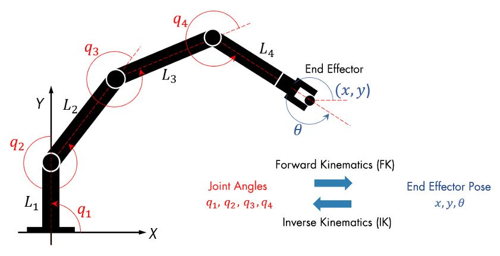

# Symbolic Calculator for Robotics
This small package implements algorithms to compute the forward and inverse kinematics of robot manipulators 
as well as the Jacobian and rigid body dynamics. I coded this to help me solve the exercises in the course *Robotics* (IN2067) at the Technical University of Munich.

*A robotic manipulator.*

## Why it is helpful

The calculations for robot manipulators can become very lengthy and are prone to errors. 
This package uses symbolic calculations, which means, that the results are mathematical formulas and can deal with variables.
Thus, you can use it to check your calculations in the exercises (since sometimes the solutions may be missing).

## Implemented Features

- Use Denavit-Hartenberg parameters to compute homogeneous transforms for individual links and the full robot.
- Propagate velocities from the base to the end-effector to read off the Jacobian.
- Compute the Jacobian matrix explicitly.
- Propagate forces and torques from the end-effector to the base to read off the torques acting on each joint.
- Determine the dynamics of the robot (joint torques from robot motion)
  - via the Newton-Euler-Method or
  - TODO: via the Lagrangian approach.

## How to use it & examples

The functions are intended to be imported into Jupyter notebooks and be used from there. 
This is because Jupyter allows for displaying formulas using LaTeX (that is, if you have it installed - otherwise it will render them with `matplotlib`).

To get a better feel of how to use the functions, look at the example notebooks under `examples/*.ipynb`.
